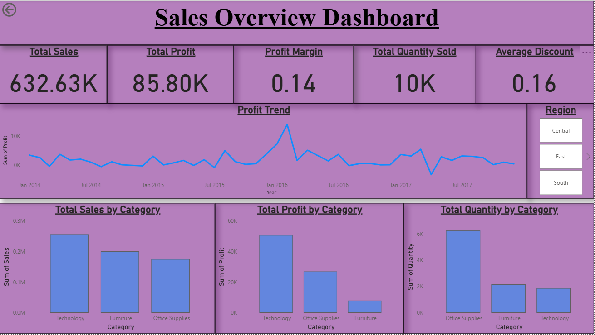
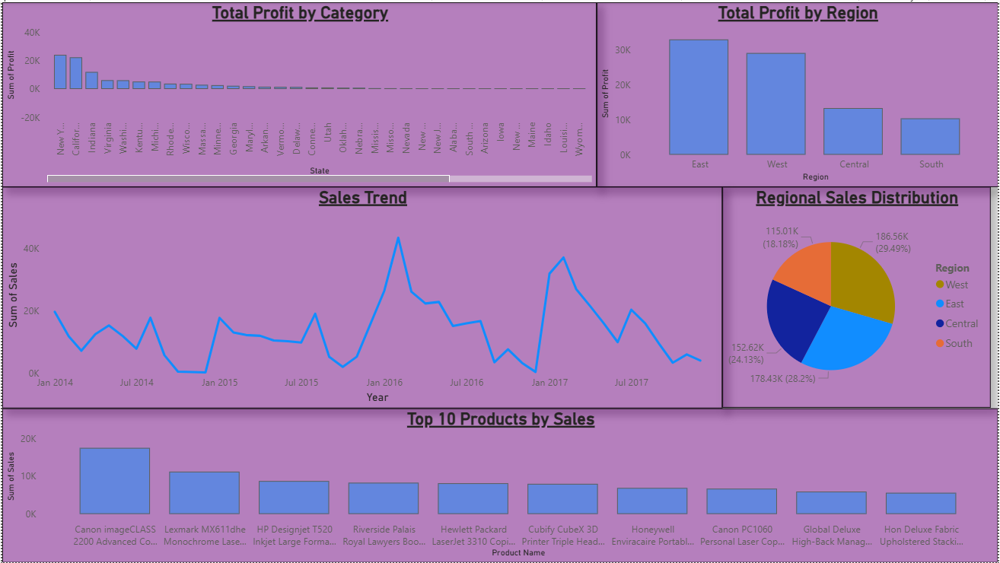
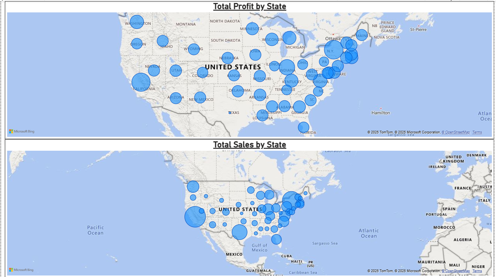

# Superstore Sales Analysis Dashboard (USA Regions & Categories)

This project is an interactive Power BI dashboard built to analyze and visualize sales performance across regions, product categories, and time. It offers key business insights using intuitive visualizations, slicers, and maps — designed without any paid Power BI services.

---

## 🔍 Overview

The dashboard presents:

- Total Sales, Profit, Quantity, and Discount KPIs
- Year-wise **Sales & Profit Trend**
- Regional filtering using slicers
- Breakdown by **Category**, **State**, and **Region**
- Geo Maps showing Sales & Profit across US States
- Top 10 Products by Sales

---
## 📌 Dashboard Pages (Screenshots)

### Page 1 - KPIs and Trends


### Page 2 - State-level Geo Analysis


### Page 3 - Deep Dive: Region & Products


---

## 📁 Dataset Info

| Column Name       | Description                       |
|------------------|-----------------------------------|
| `Order Date`      | Date of order placement           |
| `Ship Date`       | Date of shipment                  |
| `Customer ID`     | Unique customer identifier        |
| `Segment`         | Consumer, Corporate, or Home      |
| `Region`          | Central, East, South, West        |
| `Category`        | Technology, Furniture, Supplies   |
| `Sales`, `Profit` | Revenue and profit per order      |
| `Quantity`        | Units sold                        |
| `Discount`        | Discount offered on sale          |

---

## 🛠️ Tools Used

- **Power BI Desktop** (free version)
- CSV file as data source (local import)
- DAX (for KPIs like Profit Margin)
- Custom slicers and map visuals

---

## 📌 Key DAX Measures (Used in the Dashboard)

```DAX
Total Sales = SUM(Sales)
Total Profit = SUM(Profit)
Total Quantity = SUM(Quantity)
Average Discount = AVERAGE(Discount)
Profit Margin = DIVIDE(SUM(Profit), SUM(Sales), 0)
